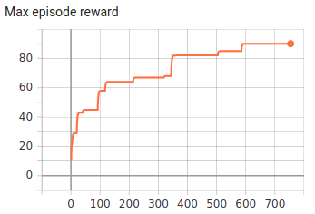
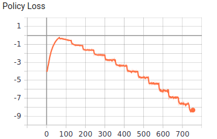
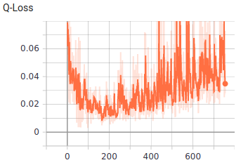
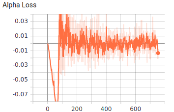

[](http://makeapullrequest.com)  

# Discrete-SAC-PyTorch
>This repository is a PyTorch implementation of the Discrete SAC on MsPacmanNoFrameskip-v4 environment.

[Soft Actor-Critic Algorithms and Applications ](https://arxiv.org/pdf/1812.05905.pdf) is known to be the state-of-the-art reinforcement algorithm for continuous action settings, however to make it applicable for discrete action settings, some modifications should be carried on its derivation:  
Continuous SAC| Discrete SAC
:-----------------------:|:-----------------------:|
| 
| 
| 

## Demo
Non-Greedy Stochastic Action Selection| Greedy Action Selection
:-----------------------:|:-----------------------:|:-----------------------:|
| 

## Results
> x-axis: episode number.

| | 
:-----------------------:|:-----------------------:|:-----------------------:|
| | 

## Table of hyper-parameters
>All values are based on the original paper.

Parameters| Value
:-----------------------:|:-----------------------:|
lr			     | 3e-4
batch_size            | 64
gamma	          | 0.99
initial_random_steps| 20000
train_period (number of steps between each optimization)| 4
fixed_network_update_freq| 8000


## Dependencies
- gym == 0.17.3
- numpy == 1.19.2
- opencv_contrib_python == 4.4.0.44
- psutil == 5.5.1
- torch == 1.6.0

## Installation
```shell
pip3 install -r requirements.txt
```
## Usage 
### How to run
```bash
main.py [-h] [--mem_size MEM_SIZE] [--env_name ENV_NAME]
               [--interval INTERVAL] [--do_train] [--train_from_scratch]
               [--do_intro_env]

Variable parameters based on the configuration of the machine or user's choice

optional arguments:
  -h, --help            show this help message and exit
  --mem_size MEM_SIZE   The memory size.
  --env_name ENV_NAME   Name of the environment.
  --interval INTERVAL   The interval specifies how often different parameters
                        should be saved and printed, counted by episodes.
  --do_train            The flag determines whether to train the agent or play
                        with it.
  --train_from_scratch  The flag determines whether to train from scratch or
                        continue previous tries.
  --do_intro_env        Only introduce the environment then close the program.
```
- **In order to train the agent with default arguments , execute the following command and use `--do_train` flag, otherwise the agent would be tested** (You may change the memory capacity and the environment based on your desire.):
```shell
python3 main.py --mem_size=135000 --env_name="MsPacmanNoFrameskip-v4" --interval=100 --do_train
```
- **If you want to keep training your previous run, execute the followoing:**
```shell
python3 main.py --mem_size=135000 --env_name="MsPacmanNoFrameskip-v4" --interval=100 --do_train --train_from_scratch
```
### Hardware requirements
- **The whole training procedure was done on Google Colab and it took less than an hour of training, thus a machine with similar configuration would be sufficient**.


## Structure
```bash
├── Brain
│   ├── agent.py
│   └── model.py
├── Common
│   ├── config.py
│   ├── logger.py
│   ├── play.py
│   └── utils.py
├── demo
│   ├── greedy.gif
│   └── non-greedy.gif
├── equations
│   ├── continuous_alpha.png
│   ├── continuous_policy.png
│   ├── continuous_v.png
│   ├── discrete_alpha.png
│   ├── discrete_policy.png
│   └── discrete_v.png
├── main.py
├── Memory
│   └── replay_memory.py
├── models
│   └── 2020-12-07-14-38-22
│       └── params.pth
├── __pycache__
├── README.md
├── requirements.txt
└── results
    ├── alpha_loss.png
    ├── alpha.png
    ├── max_episode_reward.png
    ├── policy_loss.png
    ├── q_loss.png
    └── running_reward.png
```
1. _Brain_ dir consists the neural network structure and the agent decision making core.
2. _Common_ consists minor codes that are common for most RL codes and do auxiliary tasks like: logging, wrapping Atari environments and... .
3. _main.py_ is the core module of the code that manges all other parts and make the agent interact with the environment.
4. _Memory_ consists memory of the agent.

## References
1. [_Soft Actor-Critic For Discrete Action Settings_, Christodoulou, 2019](https://arxiv.org/abs/1910.07207)
2. [_Soft Actor-Critic Algorithms and Applications_, Haarnoja et al., 2018](https://arxiv.org/abs/1812.05905)

## Acknowledgement
1. Big thanks to the author of the [reference paper](https://arxiv.org/abs/1910.07207) and the publisher of the [original code](https://github.com/p-christ/Deep-Reinforcement-Learning-Algorithms-with-PyTorch/blob/master/agents/actor_critic_agents/SAC_Discrete.py), [@p-christ](https://github.com/p-christ).
2. The [@ku2482](https://github.com/ku2482)'s code, [sac-discrete.pytorch](https://github.com/ku2482/sac-discrete.pytorch) is a great guide to implement the Discrete SAC algorithm. 